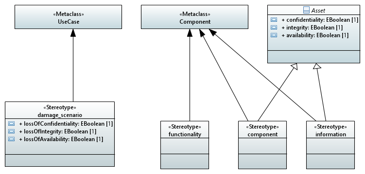

# MBSA4CPS
My masters thesis project with the name "Model-based security analysis of Cyber-Physical Systems" at the Budapest University of Technology and Economics made me explore the possibilities of potentially automatize the derivation of models that can be used for cybersecurity analysis from already existent models that are used in the automotive industry.

This project is a simple solution for papyrus based models. This project holds a (i) UML profile made for cybersecurity, (ii) a simplified model containing a (ab)use case diagram and a component diagram, (iii) a code generator made using Acceleo, that generate a threat model that will be used by the security analysis tool (https://github.com/csedome/apE) that is also developed as part of my thesis project.

## Cybersecurity profile

The cybersecurity profile is used to define stereotypes with attributes and later attach these stereotypes to system model elements.

## Abuse case diagram

Simple (ab)use case diagram that shows the potential goals of an attacker.

## Component diagram

The example only has a simple components diagram for defining system components.

But the profile can be applied to and the code generator can be modified to handle larger system models. The only thing required is to have components that can be stereotyped either information, component or functionality.

## Code generation and model transformation

The codegenerator is implemented in Acceleo because of its easy to use integration with Papyrus. 
It generates the .apeditor file to be used with apE. 

[Acceleo file](hu.bme.mit.thesis.tmgen/src/hu/bme/mit/thesis/tmgen/main/generate.mtl)

[Result](hu.bme.mit.thesis.tmgen/generated/Example.apeditor)